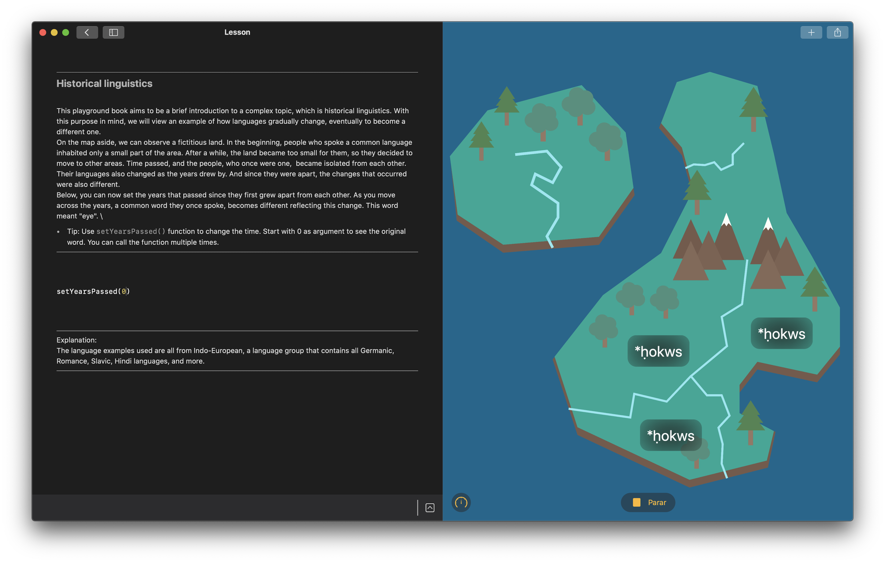

# Historical linguistics

### Swift Playgroundbook made by Thiago Nitschke Simões for WWDC20 Swift Student Challenge.

## Introduction

This playground book that features a little bit of teaching, in a fun way, from one of the topics I like the most besides code, linguistics. It shows we are all related, since back then when, we all spoke the same language (putting it simply).
I used SwiftUI because I preferred the new paradigm and the change it means in the ways we write Views.

## Download

To experience this project, download the ".playgroundbook" file in this repository, and open it using Swift Playgrounds 3.3 or above for macOS (you can also use Playgrounds for iPad).

## Author

Hi there! My name is Thiago Nitschke Simões. I'm into tech and games, also having a great love for linguistics, design, and culture in general. Jobwise, I'm an aspiring iOS developer, especially excited about making apps and games that have a wow factor.

If you want to find out more about me, please visit my [LinkedIn](https://www.linkedin.com/in/thiago-nitschke-sim%C3%B5es-844a88b6/) or [GitHub](https://github.com/thnitschke) profile.